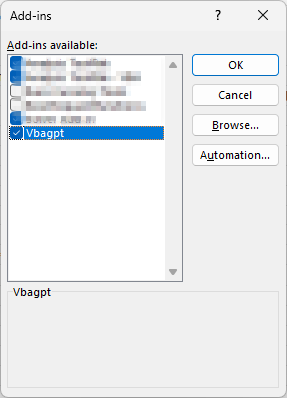

# VBAGPT - Ultra Light GPT Interface for Excel

A lightweight Excel add-in that integrates GPT functionality directly into your spreadsheets using VBA.

## Features

- **Seamless GPT Integration**: Access GPT capabilities directly within Excel
- **Custom Functions**: Use `CALLGPT()` and markdown conversion functions
- **Easy Setup**: Simple installation process
- **Cross-Platform**: Works on Windows (tested) and macOS

## Installation Guide

### Step 1: Download the Add-in

Download the VBAGPT.xlam file directly from our repository:

**[Download VBAGPT.xlam](https://raw.githubusercontent.com/mattbeard0/vbagpt/refs/heads/main/AddIn/VBAGPT.xlam)**

> **Note**: Screenshot showing the download button or link will be added here.

### Step 2: Locate Your Excel Add-ins Folder

The Excel Add-ins folder location varies depending on your Excel version and operating system:

#### Windows

- **Excel 2016/2019/365** (Tested): `C:\Users\[YourUsername]\AppData\Roaming\Microsoft\AddIns\`
- **Excel 2013**: `C:\Users\[YourUsername]\AppData\Roaming\Microsoft\AddIns\`
- **Excel 2010**: `C:\Users\[YourUsername]\AppData\Roaming\Microsoft\AddIns\`

#### macOS (Not Tested)

- `/Users/[YourUsername]/Library/Group Containers/UBF8T346G9.Office/User Content.localized/Add-ins/`

### Step 3: Copy the Add-in File

1. Navigate to your Excel Add-ins folder
2. Copy the downloaded `VBAGPT.xlam` file to this folder
3. You can either:
   - Drag and drop the file directly into the folder
   - Copy and paste the file into the folder

> **Note**: Screenshot showing the drag and drop operation or copy/paste process will be added here.

### Step 4: Enable the Add-in in Excel

1. Open Excel
2. Go to **File** → **Options** → **Add-ins**
3. Click **Go** next to "Manage: Excel Add-ins"
4. Click **Browse** and navigate to your Add-ins folder
5. Select `VBAGPT.xlam` and click **OK**
6. Check the box next to "VBAGPT" in the Add-ins list
7. Click **OK** to confirm



## Configuration

Before using the add-in, you need to configure your API settings:

### Setting API Configuration

Set the following named values in your Excel workbook:

| Name             | Value          | Description          |
| ---------------- | -------------- | -------------------- |
| `OPENAI_API_KEY` | `your-api-key` | Your OpenAI API key  |
| `OPENAI_MODEL`   | `gpt-4o-mini`  | The GPT model to use |

## Usage

### Available Functions

#### `CALLGPT(prompt)`

Calls the GPT API with the specified prompt and returns the response. The function only takes in strings, so build your prompt in a help cell, then pass to ChatGPT.

**Example:**

```excel
=CALLGPT("Summarize the following data" & A1)
```

#### `TABLETOMARKDOWN(table)`

Converts a table to markdown format with headers.

**Example:**

```excel
=TABLETOMARKDOWN(A1:D10)
```

#### `RANGETOMARKDOWN(range)`

Converts a range to markdown format.

**Example:**

```excel
=RANGETOMARKDOWN(A1:D10)
```

## Troubleshooting

### Add-in Not Appearing

- Ensure the file is in the correct Add-ins folder
- Check that the file extension is `.xlam`
- Restart Excel after copying the file

### Security Warnings

- Excel may show security warnings for add-ins
- Click **Enable Content** when prompted
- You may need to add the Add-ins folder to your trusted locations

### File Not Found

- Verify the download completed successfully
- Check that the file size matches the expected size
- Try downloading the file again if necessary

## Requirements

- **Excel**: 2010 or later
- **Internet Connection**: Required for GPT API calls
- **OpenAI API Key**: Get yours from [OpenAI Platform](https://platform.openai.com/api-keys)

## Support

For issues and questions, please check the troubleshooting section above or create an issue in the repository.

---

**Note**: This add-in requires an active internet connection to function properly, as it interfaces with GPT services. You must provide your own OpenAI API key.
